# Component Structure

```mermaid
flowchart TD
    AppLayout[App Layout] --> Navbar[Navbar]
    AppLayout --> PageContent[Page Content]
    AppLayout --> Footer[Footer]

    PageContent --> Hero[Hero]
    PageContent --> PropertySearch[PropertySearch]
    PageContent --> FeaturedProperties[FeaturedProperties]
    PageContent --> Neighborhoods[Neighborhoods]
    PageContent --> MarketStats[MarketStats]
    PageContent --> AgentsSection[Agents]
    PageContent --> Testimonials[Testimonials]
    PageContent --> FAQ[FAQ]
    PageContent --> CTA[CTA]

    PropertiesPage[Properties Page] --> PropertyFilters[PropertyFilters]
    PropertiesPage --> PropertyGrid[PropertyGrid]
    PropertyGrid --> PropertyCard[PropertyCard]

    DetailPage[Property Detail Page] --> PropertyGallery[PropertyGallery]
    DetailPage --> PropertyDetails[PropertyDetails]
    DetailPage --> MortgageCalculator[MortgageCalculator]
    DetailPage --> AgentCard[AgentCard]

    AgentsPage[Agents Page] --> AgentCard
    NeighborhoodsPage[Neighborhoods Page] --> NeighborhoodCard[NeighborhoodCard]
    ContactPage[Contact Page] --> ContactForm[ContactForm]

    SharedUI[Shared UI] --> Button[Button]
    SharedUI --> Card[Card]
    SharedUI --> Badge[Badge]
    SharedUI --> Section[Section]
    SharedUI --> Input[Input]
    SharedUI --> Select[Select]
    SharedUI --> Textarea[Textarea]
    SharedUI --> Separator[Separator]
```

## Explanation

The root layout wraps every page with Navbar and Footer. Homepage content is composed of section components. Domain-specific real-estate components handle property, agent, and neighborhood presentation. Shared UI primitives ensure consistent styling across the platform.
