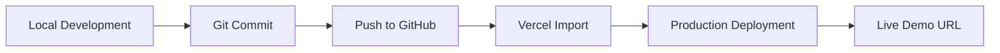

# Deployment

**Live Demo:** [https://real-estate-platform-website-three.vercel.app/](https://real-estate-platform-website-three.vercel.app/)

## Deployment Steps

1. Build locally with `pnpm build` (or `npm run build`).
2. Push the repository to GitHub (`Valakasneckle/10-real-estate-platform`).
3. Import the repository into [Vercel](https://vercel.com).
4. Deploy with default Next.js settings (framework preset: Next.js).
5. Set environment variable `NEXT_PUBLIC_SITE_URL` to the production URL.
6. Copy the live production URL after deployment.
7. Add the live URL to `README.md`, `.env.example`, and the GitHub repository About section.
8. Add the live URL to your LinkedIn profile and portfolio hub.

## Environment Variables

| Variable | Description |
|----------|-------------|
| `NEXT_PUBLIC_SITE_URL` | Public site URL for metadata and canonical links |

## Notes

- No backend or database is required for the demo deployment.
- Static mock data is bundled at build time.
- Property detail pages are pre-rendered via `generateStaticParams`.
