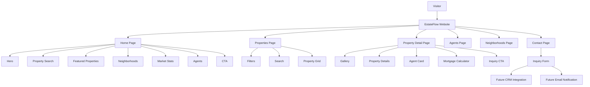

# System Overview

## Explanation

Visitors enter EstateFlow through the homepage or directly via property, agent, or contact URLs. The homepage funnels users into property search or featured listings. The properties page applies filters and renders a grid of cards. Property detail pages provide full information, agent contact, mortgage estimates, and inquiry forms. Contact submissions are UI-only in this demo but are architected for future CRM and email integration.
