# User Flow

```mermaid
flowchart LR
    A[Visitor lands on homepage] --> B[Uses property search]
    B --> C[Opens properties page]
    C --> D[Applies filters]
    D --> E[Opens property detail page]
    E --> F[Reviews property and agent]
    F --> G[Checks mortgage calculator]
    G --> H[Opens contact page]
    H --> I[Sends property inquiry]
```

## Explanation

The primary flow moves from discovery (homepage search or featured listings) to evaluation (filtered catalog and detail pages) to conversion (inquiry form or agent contact). Secondary paths include browsing neighborhoods and agents directly from the homepage or navigation. Every step is designed to reduce friction and build trust before the inquiry action.
